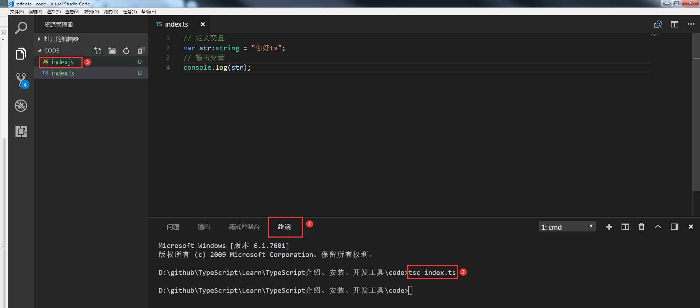
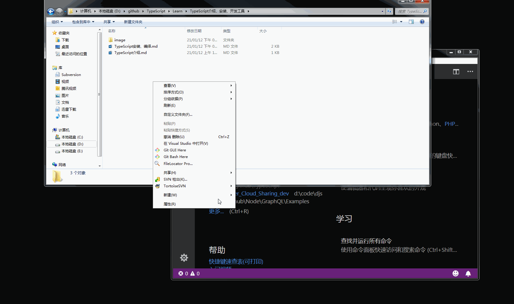

# TypeScript安装、编绎

- 在使用 npm 命令之前电脑必须安装node.js

##安装TypeScript
###npm安装方法:
    npm install -g typescript

###安装cpnm
	npm install -g cnpm --registry=https://registry.npm.taobao.org

###cnpm安装方法（国内推荐）:
    cnpm install -g typescript

###安装yarn
	npm install -g yarn
	cnpm install -g yarn

###yarn安装方法
	yarn global add typescript

###查看TypeScript版本
	tsc -v

## TypeScript安装相关资源
	
- node.js官网：http://nodejs.cn/download/
- 注：根据相应的系统下载对应的安装包，安装即可

##安装VSCode
#### 前往 https://code.visualstudio.com/ 下载安装包，安装即可

##编绎代码
###1.创建代码目录，例如创建code目录，并在code目录下创建 index.ts，将 code 目录拖放至vscode

###2.index.ts 写入如下代码
    // 定义变量
    var str:string = "你好ts";
    // 输出变量
    console.log(str);

###3.点击VSCode顶部菜单，查看->集成终端，在终端命令窗口输入编绎命令 `tsc index.ts`，
###如下图

- 注：编绎完成后，会生成对应的js文件，如图中的标3处。
- 
###4.完整操作过程如下

##VSCode工具自动编绎.ts文件
###1.创建 tsconfig.json 文件，生成命令
    tsc --init

###2.找到 tsconfig.json 文件中的 outDir 字段，修改编绎后的 js文件输出目录，例如修改为当前目录的 js 目录,
	"outDir":"./js"

###3.选择 VSCode 顶部菜单，任务->运行任务->tsc:监视 - tsconfig.json

###4.完整操作过程如下

	